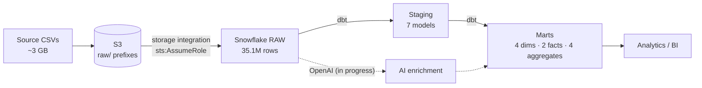

# Zomato Data Platform

Production-style analytics pipeline over a food-delivery dataset:
**S3 → Snowflake → dbt**, with an LLM enrichment layer and Airflow orchestration in progress.

**35.1M rows** loaded · **17 dbt models** · **16 data tests passing** · keyless AWS↔Snowflake auth

---

## Architecture



A medallion architecture inside one `ZOMATO` database:

| Schema | Purpose |
| --- | --- |
| `RAW` | `COPY INTO` landing zone from the S3 external stage |
| `STAGING` | Cleaned, typed, conformed models |
| `MARTS` | Gold-layer dimensions, facts, and business aggregates |
| `SNAPSHOTS` | SCD Type-2 history |
| `AI` | LLM-enriched review sentiment and topics |

---

## What this demonstrates

- **Keyless cloud auth.** Snowflake reaches S3 by assuming a dedicated IAM role guarded by an
  external ID — no AWS access keys are stored in Snowflake or anywhere in this repo. The external
  ID is what prevents the confused-deputy problem.
- **Incremental modeling at scale.** `fct_orders` (10M rows) and `fct_order_items` (23M) use dbt
  `incremental` materialization with `merge` strategy and `on_schema_change='append_new_columns'`,
  so reruns process only new keys instead of rebuilding 33M rows.
- **Defensive loading of messy data.** The four dimension exports land as all-`STRING` columns with
  `ON_ERROR = 'CONTINUE'` to skip malformed rows; the clean generated fact files use
  `ON_ERROR = 'ABORT_STATEMENT'` so row counts stay exact. Staging models then parse the mess —
  `'--'` to null, `'50+ ratings'` to `50`, `'₹200'` to `200`, city extracted from free-text address.
- **Tested transformations.** 16 dbt tests covering uniqueness, nullability, referential integrity
  between facts and dimensions, and accepted values on categorical columns.
- **Secrets discipline.** Every credential resolves through `env_var()` at runtime; the repo
  contains only placeholders and a documented `.env.example`.

---

## Data model

**Staging** (`models/staging/`) — one conformed view per source: `stg_orders`, `stg_order_items`,
`stg_restaurants`, `stg_users`, `stg_food`, `stg_menus`, `stg_reviews`.

**Marts** (`models/marts/`)

| Model | Grain |
| --- | --- |
| `fct_orders` | one row per order (10M, incremental) |
| `fct_order_items` | one row per line item (23M, incremental) |
| `dim_customers`, `dim_restaurants`, `dim_food`, `dim_date` | conformed dimensions |
| `mart_daily_city_revenue` | GMV, AOV, cancel rate by day and city |
| `mart_restaurant_performance` | per-restaurant volume and ratings |
| `mart_delivery_sla` | delivery time against SLA |
| `mart_review_insights` | sentiment rollup *(requires the AI layer)* |

---

## Stack

Snowflake · dbt-core 1.12 · AWS S3 + IAM · Python 3.11 · Airflow *(in progress)* · OpenAI *(in progress)*

---

## Status

- [x] Snowflake warehouse, medallion schemas, RBAC
- [x] S3 storage integration and external stage
- [x] RAW ingestion — 7 tables, 35.1M rows
- [x] Staging layer — 7 models
- [x] Marts layer — dimensions, incremental facts, business aggregates
- [ ] AI enrichment over review text (`mart_review_insights` depends on this)
- [ ] Airflow orchestration
- [ ] BI dashboard

---

## Running it

```bash
python3.11 -m venv .venv && .venv/bin/pip install -r requirements.txt
cp .env.example .env            # fill in Snowflake + AWS values
set -a && source .env && set +a

cd zomato
../.venv/bin/dbt build          # run models + tests
../.venv/bin/dbt docs generate && ../.venv/bin/dbt docs serve
```

Infrastructure setup — S3 bucket, IAM role, storage integration, and the `COPY INTO` loads — is
documented step by step in **[docs/RUNBOOK.md](docs/RUNBOOK.md)**.

Source CSVs are not versioned (`data/` is gitignored, ~3 GB). Dataset from
[darshilparmar/zomato-ai-data-engineering-end-to-end-project](https://github.com/darshilparmar/zomato-ai-data-engineering-end-to-end-project).

```
aws/iam/             IAM trust + permission policies
snowflake_scripts/   Warehouse, integration, and load SQL (numbered in run order)
zomato/              dbt project
docs/                Setup runbook
```
